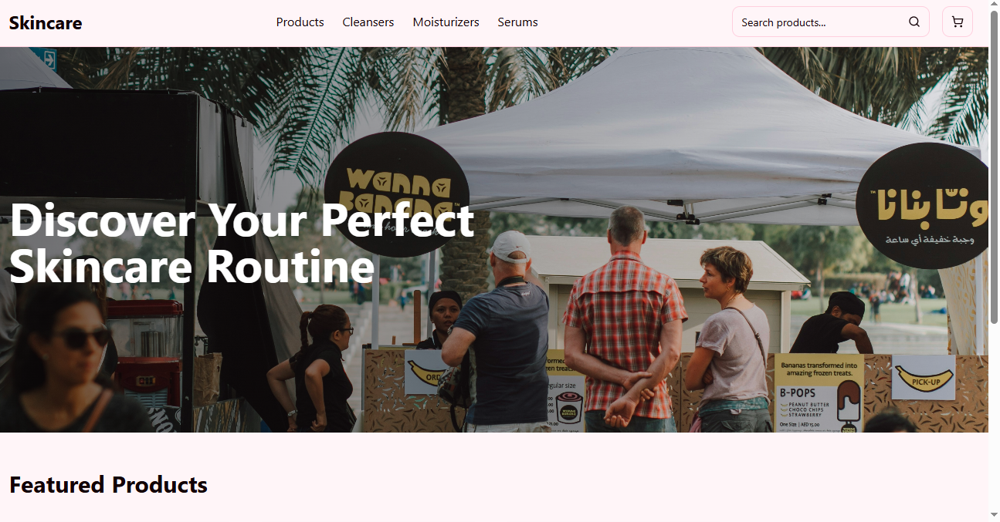

# Skincare E-commerce Application

A full-featured e-commerce platform for skincare products built with modern web technologies. The application features a React frontend with TypeScript and an Express.js backend.



## Features

- 🛍️ **Product Browsing** - Browse and search for skincare products
- 🔍 **Product Filtering** - Filter products by category (cleansers, moisturizers, serums)
- 🛒 **Shopping Cart** - Add products to cart, update quantities, and remove items
- 💯 **Responsive Design** - Works on desktop and mobile devices
- 🎨 **Modern UI** - Sleek design with Tailwind CSS and Shadcn UI components

## Tech Stack

### Frontend
- **React** - UI library
- **TypeScript** - Type safety
- **Tailwind CSS** - Utility-first styling
- **Shadcn UI** - Modern UI components
- **React Query** - Data fetching and state management
- **Wouter** - Lightweight routing

### Backend
- **Express.js** - Web server framework
- **TypeScript** - Type safety
- **Drizzle ORM** - Database ORM
- **NeonDB** - Serverless PostgreSQL database

## Getting Started

### Prerequisites
- Node.js (v16 or higher)

### Installation
1. Clone the repository
2. Install dependencies:
```bash
npm install
```

### Development
To start the development server:
```bash
npm run dev
```
This will run the application on port 5000.

### Building for Production
```bash
npm run build
```

### Starting in Production
```bash
npm start
```

## Project Structure
- **client/** - React frontend code
  - **src/components/** - Reusable UI components
  - **src/pages/** - Page components
  - **src/hooks/** - Custom React hooks
  - **src/lib/** - Utility functions
- **server/** - Express.js backend code
  - **routes.ts** - API route definitions
  - **db.ts** - Database configuration
- **shared/** - Shared code between frontend and backend
  - **schema.ts** - Type definitions

## API Endpoints
- **GET /api/products** - Retrieve products
  - Query parameters:
    - `category`: Filter by product category
    - `featured`: Get featured products only
    - `search`: Search products by name

## Shopping Cart Functionality
The application includes a client-side cart system that allows users to:
- Add products to their cart
- Update product quantities
- Remove items from the cart
- Calculate the total price

## Deployment
This project is configured to be deployed on Replit.

## License
MIT
habizinnia@gmail.com